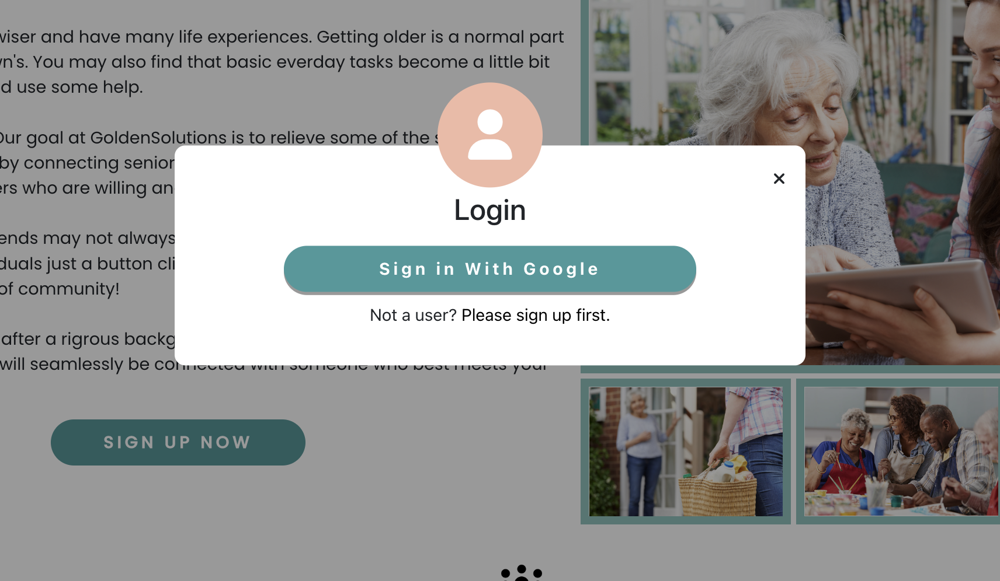
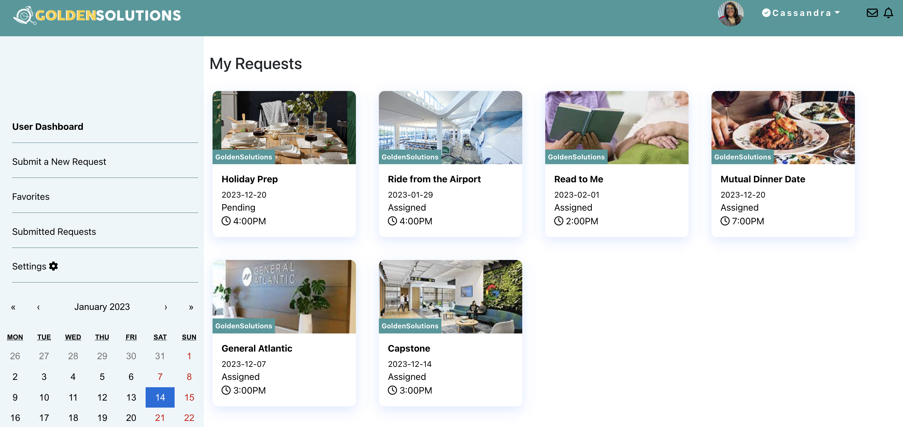
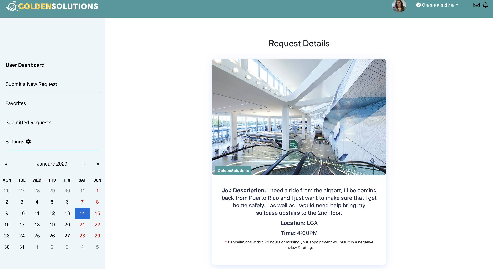

## Table of Contents

- [Overview](#overview)
- [Technologies](#technologies)
- [Features](#features)
    - User Auth
    - CRUD
- [Challenges](#challenges)
    - Using Firebase to allow a user to sign in with Google
    - Calendar functionality
- [Examples](#examples)

## OVERVIEW

GoldenSolutions is an application that allows senior users to connect with volunteer users. Users with a senior account can upload requests they need help with and users with a volunteer account can accept or decline those requests. 

This app was created by a team of 5 junior web developers using PostgreSQL for Database Mangement, Express on the backend, React on the front end, and Firebase for GoogleAuth.

- [Netlify Deployment for front-end](https://goldensolutions.netlify.app/)
- [Render Deployment for back-end](https://goldensolutions-5z0f.onrender.com/)

## TECHNOLOGIES

- Javascript
- React
- PostgreSQL DB
- Express
- CSS & React Bootstrap
- Firebase

## FEATURES

**User Auth**

- Users can sign up and create a new account via multiple pages on the app while still being able to enjoy other functionality while not logged in.
- Users who have not created an account and attempt to sign in with Google will be redirected to sign up.

**Request Index**

- There are two user dashboard views, one for a senior account and one for a volunteer user account. 
- Users can view requests they've submitted, accepted or that are pending and sort by date using the calendar. 
- Requests are orgaized on the User Dashboard page according to the date

**Request Creation**

- Users can create, store, and manage requests through from their dashboard.
- Users can submit for their request a title, time, date, description, location, and image that will persist to the form.

## CHALLENGES

**Preventing Auto Sign-Up With Firebase**

Incorporating Firebase and a sign in with Google feature meant that if a user were to attempt to sign in with Google before signing up with our form, a Firebase account would be created for them automatically and no account would exist for that user in the database. 

To circumvent this issue a user's UUID is checked when they sign in with a Google account. If they do not exist in our database, they are deleted from Firebase. An alert is issued to the user that they must sign up first. 

```
export const signInWithGoogle = () => {
  try {
    signInWithPopup(auth, googleProvider).then((res) => {
      const loggedInUser = res.user;
      const isNewUser = getAdditionalUserInfo(res).isNewUser;

      if (isNewUser) {
        loggedInUser.delete().then(() => {
          signOut().then(() => {
            console.log("Signed Out!");
            alert("Please Sign Up First!!");
          });
        });
      }
    });
  } catch (error) {
    console.error(error);
  }
};
```

## EXAMPLES

**Home Page**


**Login Modal**


**Request Index**


**Request Show**
